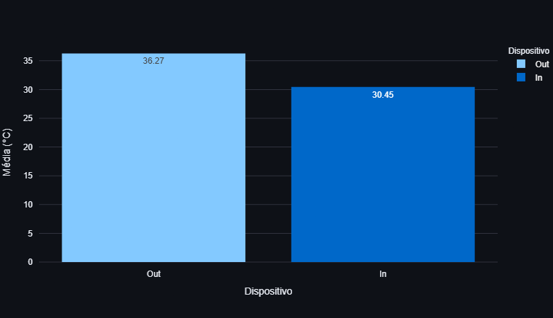
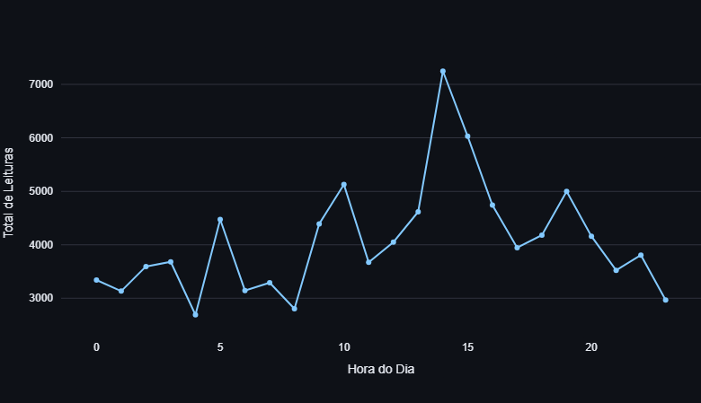
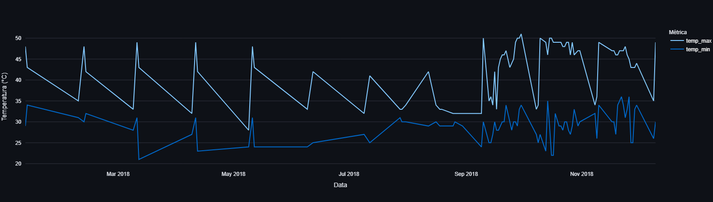

# 🌡️ Pipeline de Dados IoT 

Pipeline completo de visualização de dados para monitoração térmica de dispositivos IoT.


---

## Dashboard





---


##  Tecnologias Utilizadas

* **Linguagem:** Python 3.10+
* **Manipulação de Dados:** Pandas
* **Banco de Dados & Conexão:** PostgreSQL & SQLAlchemy
* **Containerização:** Docker Desktop
* **Dashboard & Gráficos:** Streamlit & Plotly Express

---

---

##  Base de Dados

O conjunto de dados utilizado provém do Kaggle e contém registros de temperatura e localização de sensores IoT.

* **Fonte:** [Kaggle - IoT Temp & Humidity Data](https://www.kaggle.com/datasets/atulanandjha/temperature-and-humidity-dataset-iot-sensor-data)
* **Arquivo:** `IoT-temp.csv` (deve ser posicionado dentro do diretório `/data`).

---

##  Como Executar 

### Pré-requisitos
* [Docker Desktop](https://www.docker.com/products/docker-desktop/) instalado e em execução.
* [Python 3.10+](https://www.python.org/) instalado.

### 1. Clonar o repositório
```
git clone [https://github.com/SEU_USUARIO/pipeline-iot-docker.git](https://github.com/joaovitor-a1/pipeline-iot-docker.git)
cd pipeline-iot-docker
```
### 2. Configurar o ambiente virtual Python
```
# Criar ambiente virtual
python -m venv venv

# Ativar ambiente virtual (Windows PowerShell)
.\venv\Scripts\activate

# Instalar dependências
pip install -r requirements.txt
```

### 3. Iniciar o container do PostgreSQL no Docker
```
docker run --name postgres-iot -e POSTGRES_PASSWORD=123456 -e POSTGRES_DB=iot_db -p 5432:5432 -d postgres
```

### 4. Executar o pipeline de ingestão (ETL)
```
python src/ingest_data.py
```

### 5. Iniciar o Dashboard
```
streamlit run src/dashboard.py
```

## Estrutura de Pastas

```text
pipeline-iot-docker/
├── src/
│   ├── ingest_data.py         # Script de ETL e criação de Views SQL
│   └── dashboard.py           # Interface gráfica interativa no Streamlit
├── data/
│   └── IoT-temp.csv           # Base de dados bruta de sensores
├── screenshots/
│   ├── img1.png               # Média de temperatura (In vs Out)
│   ├── img2.png               # Volumetria de leituras por hora
│   └── img3.png               # Máximas e mínimas diárias
├── requirements.txt           # Dependências do projeto
├── .gitignore                 # Arquivos ignorados pelo Git
└── README.md                  # Documentação do projeto
```


## Comandos Git Utilizados

```

```